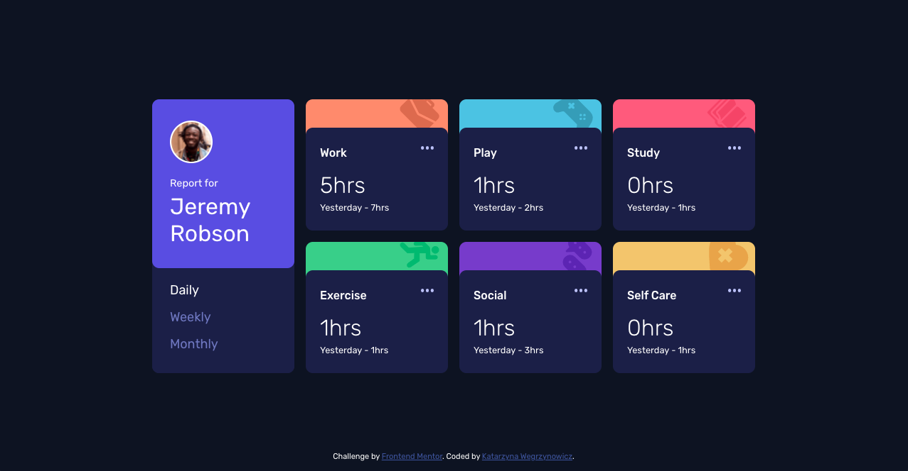

# Frontend Mentor - Time tracking dashboard solution

This project was bootstrapped with [Create React App](https://github.com/facebook/create-react-app).

This is a solution to the [Time tracking dashboard challenge on Frontend Mentor](https://www.frontendmentor.io/challenges/time-tracking-dashboard-UIQ7167Jw). Frontend Mentor challenges help you improve your coding skills by building realistic projects. 

## Table of contents

- [Overview](#overview)
  - [The challenge](#the-challenge)
  - [Screenshot](#screenshot)
  - [Links](#links)
- [My process](#my-process)
  - [Built with](#built-with)
  - [Useful resources](#useful-resources)
- [Author](#author)

## Overview

### The challenge

Users should be able to:

- View the optimal layout for the site depending on their device's screen size
- See hover states for all interactive elements on the page
- Switch between viewing Daily, Weekly, and Monthly stats

### Screenshot

### Links

- Solution URL: [https://github.com/katarzyna-kw/time-tracking-dashboard](https://github.com/katarzyna-kw/time-tracking-dashboard)
- Live Site URL: [https://katarzyna-kw.github.io/time-tracking-dashboard/](https://katarzyna-kw.github.io/time-tracking-dashboard/)

## My process

### Built with

- [React](https://reactjs.org/)
- Semantic HTML5 markup principles
- CSS custom properties
- Flexbox
- CSS Grid
- Mobile-first workflow

### Useful resources

- [Solved with CSS! Colorizing SVG Backgrounds](https://css-tricks.com/solved-with-css-colorizing-svg-backgrounds/) - Helpful resource for how to change the color of an svg icon using the CSS filter property.
- [Comparing CSS Pseudo-Classes: nth-child vs nth-of-type](https://www.digitalocean.com/community/tutorials/css-css-nth-child-vs-nth-of-type) - This is a great, easy-to-understand article about these 2 CSS pseudoclasses.

## Author

- Website - [Katarzyna Wegrzynowicz](https://katarzyna-kw.github.io/portfolio-website/)
- Frontend Mentor - [@katarzyna-kw](https://www.frontendmentor.io/profile/katarzyna-kw)